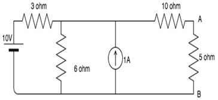

## Pre Test

#### Please attempt the following questions

### Note- Reference books are available in the reference section.

### 
<b>Superposition Theorem</b> 

<b>Q1. A system which follows the superposition principle is known as-</b>

A  System 
B  Control system 
C  Linear system 
D  Unilateral system 

<b>Q2. In applying superposition theorem, to determine branch current and voltages-</b>

A  All current and voltage sources are shorted 
B  Only current sources are open-circuited 
C  Only voltage sources are shorted 
D  Voltage source are shorted and current sources are open- circuited 

<b>Q3. Superposition theorem is applicable to-</b>

A  Current only 
B  Voltage only 
C  Both current and voltage 
D  Current, voltage and power 

<b>Q4. In electrical circuits states that for a response (voltage and current) in any branch of a bilateral linear circuit having more than one independent source equals the algebraic sum of the responses caused by each source acting alone-</b>

A  Norton’s theorem 
B  Thevenin’s theorem 
C  Superposition theorem 
D  Dulity theorem 

<b>Q5. A linear circuit contains ideal resistors and ideal voltage source. If values of all the resistors are halved then the voltage across resistor becomes-</b>

A  Half 
B  Doubled 
C  Remained unchanged 
D  Decreased by 4 times 

### 
<b>Norton's Theorem</b> 

<b>Q6. The Norton current is the_______</b>

A  Short circuit current 
B  Open circuit current 
C  Open circuit and short circuit current 
D  Neither open circuit nor short circuit current 

<b>Q7. Norton resistance is found by-</b>

A  Shorting all voltage sources 
B  Opening all current sources 
C  Shorting all voltage sources and opening all current sources 
D  Opening all voltage sources and shorting all current sources 

<b>Q8. Isc is found across the ____________ terminals of the network.</b>

A  Input 
B  Output 
C  Neither input nor output 
D  Either input or output 

<b>Q9. Find the Norton resistance for the given circuit if 5 ohm is the load resistance?</b>

A  10 ohms 
B  11 ohms 
C  12 ohms 
D  13 ohms 

<b>Q10. Find the current in the 5 ohm resistance using Norton’s theorem?</b>

A  1A 
B  1.5A 
C  0.25A 
D  0.5A 

### 
<b>Maximum Power Transfer Theorem</b> 

<b>Q11. In maximum power transfer theorem internal resistance must be-</b>

A  Greater than the internal resistance 
B  Equal to zero 
C  Equal to the load resistance 
D  Equal to the internal resistance 

<b>Q12. What is the maximum power transferred to a load for a resistive thevenin’s circuit and condition for which is occurs?</b>

A  Pmax=(4V2th)/(Rth) and RL=Rth 
B  Pmax=(V2th)/(4Rth) and RL=Rth 
C  Pmax=(V2th)/(2Rth) and RL=(Rth)/2 
D  Pmax=(2V2th)/(Rth) and RL=2Rth 

<b>Q13. Under the condition of maximum power efficiency is -</b>

A  100% 
B  0 
C  30% 
D  50% 

<b>Q14. Does maximum power transfer imply maximum efficiency?</b>
        
A Yes 
B No 
C Sometimes 
D Cannot be determined 

<b>Q15. Name some devices where maximum power has to be transferred to the load rather than maximum efficiency -</b>
         
A  Amplifiers 
B  Communication circuits 
C  Both amplifiers and communication circuits 
D  Neither amplifiers nor communication circuits 

### 
<b>Thevenin's Theorem</b> 

<b>Q16. The application of Thevenin’s theorem in a circuit result in -</b>

A  An ideal voltage source 
B  An ideal current source 
C  A current source and impedance in parallel 
D  A voltage source and impedance in series 

<b>Q17. Thevenin’s theorem cannot be applied to -</b>

A  Linear circuit 
B  Non-linear circuit 
C  Active circuit 
D  Passive circuit 

<b>Q18. For a network, Thevenin equivalent is given by VTH = 10 V and RTH = 50 ohms. If this network is shunted by another 50 ohm at load. What is the new Thevenin equivalent of the network?</b>

A  5V, 50ohm 
B  5V, 25ohm 
C  10V, 50ohm 
D  10V, 25ohm 

<b>Q19. VTH is found across the ____________ terminals of the network.</b>

A  Input 
B  Output 
C  Neither input nor output 
D  Either input or output 

<b>Q20. How the Thevenin’s impedance and Norton impedance are correlated in AC circuit ?</b>

A   Always the same 
B   Generally, the same 
C   Sometimes the same 
D   Always different 

