### Theory

### Introduction   

In Electrical Engineering, Network Theorem is the study of how to solve circuit problems by determining the voltages and currents in the circuit. This Theory provides insights of basic circuit concepts in a systematic manner suitable for analysis.  

Some of the Network Theorems are briefly discussed below: 

<b> 1. Superposition Theorem 
2. Norton's Theorem 
3. Maximum Power Transfer Theorem 
4. Thevenin's Theorem </b>

 ###  <b> 1. Superposition Theorem </b>

The superposition theorem is used in solving a network in which two or more sources are present and connected not in series or in parallel. The strategy used in the Superposition theorem is to eliminate all but one source of power within a network at a time, using series/parallel analysis to determine voltage drops (and/or currents) within the modified network for each power source separately.  

<b>STATEMENT:</b>

<i><b>“If two or more voltage or current sources are acting simultaneously in a linear network, the resultant current or voltage in any branch is the algebraic sum of the currents or voltages that would be produced in it, when each source acts alone and all other independent sources are replaced by their internal resistances.”</b></i>

<b>Step 1 –</b> Take only one source and deactivate the other sources (Voltage source replaced by a short circuit and current source is replaced by an open circuit). Obtain the branch currents and voltage drop.

<b>Step 2 –</b> Repeat the step 1 for each of the independent sources.

<b>Step 3 –</b> To determine the net branch current using superposition theorem, add the currents and voltages (polarity would be same ) obtained in the step 1 and step 2 for each branch. If the currents obtained in step 1 and step 2 are in same direction then add then and if the respective currents are in the opposite direction in each step, then take the direction of original current as reference and subtract the current of opposite direction. The net current in each branch is then calculated-   

<b>PART(A): When Both are Voltage sources-</b> 

 
Figure 1: Voltage Source Circuit
  
In the circuit above, Since we have two source of voltage, We will have to calculate two sets of value  for voltage drops and/or currents, One for the circuit with only the V1 battery in effect and one for the circuit with only the V2 battery in effect. We have to find the branch current I2 in resistance R2 (load resistance) by using superposition theorem.   

<b>Step 1 –</b> When we consider one voltage source V1 alone at first and replacing V2 by short circuit.

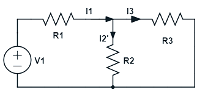
 
Figure 2: After Removal V2 Voltage Source 
  

Here, the branch current of resistance R2 is I2’

<!-- 
 -->
  $$Req1 = R1+\frac{R2⋅R3}{R2+R3}$$  

   $$I1 =\frac {V1} {(Req)1}$$  

$$I2’ = I1\times \frac{R3}{R2+R3}.....(1)  $$

$$V2’ = I1’⋅R2 .....(i)  $$

<b>Step 2 –</b> 

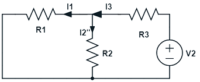
 
Figure 3: After Removal V1 Voltage Source 
  

Take the source V2 alone, and replacing the V1 by short circuit. 

Here, the branch current I2” 

$$(Req)2 = R3+\frac{R1⋅R2}{R1+R2}$$ 

$$I3 = \frac{V2}{(Req)2} $$ 

$$I2” = I3\times \frac{R1}{R1+R2} ......(2) $$

$$V2’’ = I2’’⋅R2 ....(ii) $$

<b>Step 3 –</b> By applying superposition theorem,

Overall current in R2 (since direction of current are same in both cases), from equation 1 & 2…. $$I2 = I2' + I2''$$ 

And overall voltage drop across R2 ( since polarity is same in both case), from equation (i) & (ii)…
$$ V2 = V2' + V2'' $$

<b>PART(B): When one Current and one Voltage source-</b> 

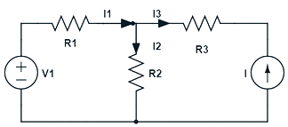
 
Figure 4: One Current and One Voltage Source 
  
In above circuit, Since we have one source of voltage and one source of current , we will have to calculate two sets of value currents, one for the circuit with only the V1 battery in effect and one for the circuit with only the I1 in effect.    
We have to find the branch current I2  in resistance R2 (load resistance) by using superposition theorem.   

<b>Step 1 –</b> Take the source V1 alone at first, replacing source I1 by open circuit.

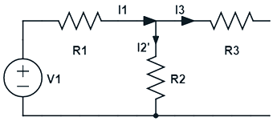
 
Figure 5: After Removal Current Source 
  

Here, the branch current I

$$I1 = I2’=\frac{V1}{R1+R2}..........(3) $$ 

$$V2’ = I2’⋅R2..............(iii)   $$

<B>Step 2 –</b> Take the current source I alone, and replacing the V1 by short circuit.

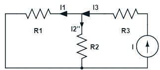
 
Figure 6: After Removal Voltage Source 
  

Here, the branch current of R2……

$$I2” = I3\times \frac{R1}{R1+R2}........(4)   $$ 

$$V2” = I2”⋅R2 .........(iv)   $$

<b>Step 3 –</b> By applying superposition theorem,

Overall current in R2 (since direction of current are same in both cases), from equation 3 & 4….

$$ I2 = I2'+ I2'' $$

And overall voltage drop across R2 ( since polarity is same in both case), from equation (iii) & (iv)…..

$$V2 = V2'+ V2''$$

<b>PART(C): When Both are Current sources-</b>

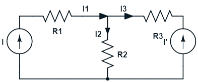
 
Figure 7: Two Current Source 
  

In above circuit, Since we have two source of current , we will have to calculate two sets of value currents, one for the circuit with only the I in effect and one for the circuit with only the I’ in effect.  

We have to find the branch current I2  in resistance R2 (load resistance) by using superposition theorem.

<b>Step 1 –</b>

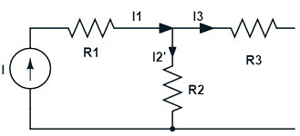
 
Figure 8: After Removal I2 Current Source 
  

Take the current source I alone at first, replacing current source I’ by open circuit.
$$ I3 = 0 $$

$$I = I1 = I2’......(5)  $$

<b>Step 2 –</b> Take the current source I’ alone, and replacing the I by short circuit.

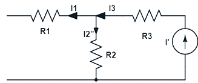
 
Figure 9: After Removal I1 Current Source 
  

$$I1 = 0 $$

$$I’ = I3 = I2’’......(6)  $$

<b>Step 3 –</b> By applying superposition theorem

Overall current in R2 (since direction of current are same in both cases), from equation 5 & 6….

$$I2 = I2' + I2'' $$

And overall voltage drop across R2 (since polarity is same in both case), from equation (v) & (vi)…..

$$V2 = V2' + V2''  $$

### <b>Advantages of Superposition Theorem: </b>

1. This Theorem is valid for all types of linear circuits having time-varying or time-invariant elements.

2. This theorem provide basis for the analysis of circuit.

3. Superposition theorem used for application of network sources element.

4. Any circuit can be converted into Thevenin equivalent using this theorem.

### <b>Disadvantages of Superposition Theorem: </b>

1. As this theorem is based on the linearity so it is not possible to calculate the power using this theorem.

2. In case of un-balanced bridge circuit this theorem can’t be use.

3. The one big limitation is that this theorem only applied to the circuits with more than one source.

### <b>2. Norton's Theorem</b>

<b>Norton Theorem states that</b> <b><i>"any two terminal linear network or circuit can be represented with an equivalent network or circuit consisting of a current source in parallel with a resistor."</b></i>

It is known as Norton’s equivalent circuit. A linear circuit may contain independent sources, dependent sources and resistors.

When the current passes through the resistor, there is a loss in energy and therefore a voltage drop. If a circuit has multiple independent sources, dependent sources, and resistors, then the response in an element can be easily found by replacing the entire network to the left of that element with a Norton’s equivalent circuit.

The response in an element can be the voltage across that element, current flowing through that element or power dissipated across that element. Any complex bilateral network can be replaced by a simple Norton equivalent circuit. Norton equivalent circuit consists of an equivalent impedance connected parallel with a current source and load resistance. The constant current source used in Norton equivalent circuit is known as Norton current <b>IN</b> or short circuit current <b>ISC</b>. Norton theorem was derived by Hans Ferdinand Mayer and Edward Lawry Norton in 1926.
For example, let’s consider the following circuit with source <b>VS</b> and load <b>RL</b>.

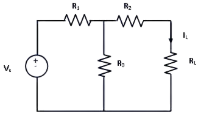
 
Figure 1: Circuit Diagram for Norton Theorem 
  
In order to find the current through <b>RL</b>, the load resistance is short circuited as shown in following figure:

 
Figure 2: Circuit to calculate Norton Current IN 
  

From this figure,
$$ I = \frac {VS}{R1}+\frac{R2⋅R3}{R2+R3}  $$
$$I_{SC} = I\times \frac{R3}{R2+R3}.....(1)   $$

Next independent source is deactivated and short circuited is removed,

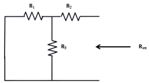
 
Figure 3: Circuit to calculate Norton Equivalent resistance after removing load resistance 
  

From figure, 
$$ R_N = R2+\frac{R1⋅R3}{R1+R3}.........(2) $$

As per Norton’s theorem, the equivalent circuit would contain a current source in parallel to the Norton resistance, the current source being the short circuited across the short-circuited terminals of load.

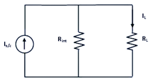
 
Figure 4: Equivalent Load Current 
  

From equivalent circuit,  
$$ I_L =  I_{SC}\times \frac{R_{INT}}{{R_{INT}}+R_L}........(3) $$

### <b>Advantages of Norton's Theorem:</b>

1. It reduces complex circuit to a simple circuit viz a single current source in parallel with a equivalent resistance.

2. It greatly simplifies the portion of the circuit of lesser importance and enable us to view the action of output part directly.

3. The theorem particularly useful to find current in particular branch of the network as that resistance of the branch is varied while all other resistance and emf source remains constant.

### <b>Disadvantages of Norton's Theorem:</b>

1. Norton theorem is not applicable to the circuits consists of unilateral elements or nonlinear elements.

2. Not applicable to the circuits consists of load in series or parallel with controlled or dependent sources.

3. Not applicable to the circuits consists of magnetic locking, coupling between the load and any other circuit element.

### <b>3. Maximum Power Transfer Theorem</b> 

<b><i>“Maximum Power Transfer Theorem states that to generate maximum external power through a finite internal resistance (DC network), the resistance of the given load must be equal to the resistance of the available source."</i></b>

In other words, the resistance of the load must be the same as Thevenin’s equivalent resistance. In the case of AC voltage sources, maximum power is produced only if the load impedance’s value is equivalent to the complex conjugate of the source impedance.”

 
Figure 1: Circuit for maximum power transfer theorem 
  

The Vth and Rth are the Thevenin-equivalent voltage and internal resistance of the source, respectively. RL is the load resistance and V is the voltage across load. Current through the load is…. 

$$ I_L = \frac {V_{th}}{{R_{th}}+{R_L} }  $$

Power dissipiated by load ….

$$ P_L = (I_L)^2⋅R_L $$

$$ P_L = {\left(\frac {V_{th}} {{R_{th}}+{R_L}}\right)}^2⋅R_L  $$

Since Vth and Rth are Thevenin equivalents and constant power depends on RL. To find the value of RL for which power is maximized, the above expression is differentiated with respect to RL and then equated to zero.  
$$ \frac {d{P_L}} {d{R_L}} = 0  $$

The value obtained for RL is..
$$ R_L = R_{th}  $$

So, Power dissipated in the load is at a maximum when load resistance equals source internal resistance. When we talk about AC circuits, load impedance is equal to the complex conjugate of source impedance. If we calculate maximum power of load resistance that is….
$$ P_L = {\left(\frac {V_{th}} {{R_{th}}+{R_L}}\right)}^2⋅R_L  $$

Since,

$$ R_L = R_{th} $$

$$ I_L = \frac {V_{th}} {2R_{th}}   $$

$$ P_{max} = \frac {V^2_{th}}{4R_{th}}........(1) $$

The purpose of the maximum power theorem is to find the optimal ratio of load impedance to source impedance for the purpose of power transfer. The theorem essentially states that the maximum magnitude of power efficiency, which is the ratio will be dissipated by a load resistance when said resistance is equal to the Thevenin-Norton resistance of the power-supplying network. When the voltage and magnitude of internal resistance of the source are fixed, sometimes it is ideal to have the maximum magnitude of power transferred to the load at the expense of optimal efficiency. When power is limited, it’s critical to transfer as much as possible, and impedance matching is essential.  
Variation of maximum power and load resistance…

 
Figure 2: Plot between load resistance and power  
  

The maximum power transfer theorem deals with matching impedance. And while it aids in the design of efficient circuits, it does not coincide with maximum power input efficiency at all. This theorem is useful when the maximum possible magnitude of power must be transferred from a fixed source. For systems in which input voltage does not normally change and maximum power transfer is required, achieving maximum efficiency is not important. This theorem states that the maximum power that can be transferred from source to load is Pmax which occurs when source impedance is exactly matched to load impedance. Power generated by source: 
$$ Ps = I^2_L⋅R_{th} + I^2_L⋅R_L   $$

Since, 

$$ R_L = R_{th} $$

$$ Ps = 2(I_L)^2 R_{th} $$ 

$$ Ps = \frac {V^2_{th}}{2R_{th}}......(2) $$

Efficiency, 

$$ Ƞmax = {\Large\frac {\frac {V^2_{th}}{4R_{th}}}{\frac {V^2_{th}}{2R_{th}}}}\times100\%  $$

 $$ Ƞmax = 50\%  $$

Therefore, The efficiency of maximum power transfer is 50%. That’s why we can say, Maximum power transfer and maximum efficiency are different entities. If load resistance is increased, higher efficiency can be achieved. Efficiency is the percentage of input power that is dissipated in the load. The maximum power transfer theorem tells us the load resistance, which will get maximum magnitude of power delivered to it by the source. However, input power from the source depends on load, If load resistance is increased, overall power decreases in magnitude, but the percentage of input power transferred to load increases. In other words, when load resistance increases, more power is dissipated in the load than in the source impedance. Hence, efficiency is increased. The magnitude of overall power is decreased however, due to the increased resistance. Similarly, if load resistance is decreased, a lower percentage of total input power is dissipated in the load and efficiency decreases.

### <b>Advantages of Maximum Power Transfer Theorem:</b>

1. The maximum power transfer theorem can be applied in the complex network.

2. It can be used in AC and DC both networks.

3. This theorem is used wherever all the autonomous sources are deactivated & the source impedance is simply considered equal to the load impedance, then a maximum quantity of power can be transmitted.

4. This theorem can be applied to communication lines.

### <b>Disadvantages of Maximum Power Transfer Theorem:</b>

1. Maximum power transfer theorem is not used in the networks like nonlinear as well as unilateral. .

2. It is not applicable in power system, due to its 50% efficiency. So the main concern of this is efficiency.

3. This theorem can be applied to communication lines instead of power lines because if we applied to power lines, then practical problems will occur.

4. In power lines, receiving end voltage constancy is a significant condition, due to less efficiency, this cannot be accepted within power lines.

### <b>4. Thevenin's Theorem</b>

Thevenin’s theorem states that any two terminal linear network or circuit can be represented with help of an equivalent network or circuit consisting a voltage source in series with a resistor. It is known as Thevenin’s equivalent circuit. A linear circuit may contain independent sources, dependent sources, and resistors.

If the circuit contains multiple independent sources, dependent sources, and resistors, then the response in an element can be easily found by replacing the entire network to the left of that element with a Thevenin’s equivalent circuit.

The response in an element can be the voltage across that element, current flowing through that element, or power dissipated across that element.

It is mathematical technique which simplifies two port network to a series circuit consisting a voltage source called Thevenin’s voltage and equivalent impedance across the two port as thevenin’s resistance.

Application of thevenins theorem can be explained by the following example. Suppose, it is required to find current flowing through load resistance RL, as shown in figure 1.

 
Figure 1: Circuit with source E and load RL  
  
<b>Steps to be followed to find Thevenin’s circuit-</b>    

1. Remove RL from the circuit terminals A and B and redraw the circuit as shown in figure 2. The terminals A and B gets open circuited.

 
Figure 2: Circuit with RL removed  
  

2. Calculate the open circuit Voltage which appears across terminals A and B when they are open i.e. when RL is removed.

As seen, VO.C. = drop across R2= IR2 where, I is the circuit current when A and B is open.

$$I=\frac E{r+R1+R2} $$ 

$$V_{O.C.} = I\times R1 $$

$$ V_{O.C.} = E\times\frac{R2}{r+R1+R2} .......(1) $$

It is also called Thevenin voltage <b>(Vth).</b>  

3. Now remove the battery from the circuit leaving only its internal resistance r, redraw the circuit as shown below

 
Figure 3: Circuit with E and RL removed 
  

When viewed from terminals A and B, the circuit consists of two parallel paths one containing R2 and another path with r and R1. The equivalent resistance of the circuit as viewed from terminals is given as

$$ R_{th} = \frac {(R1+r).R2} {R1+r+R2}....... (2) $$

The resistance Rth is also called as Thevenin’s equivalent resistance.

4. RL is now connected back across terminals A and B from where it was temporarily removed earlier. Current flowing through RL is given by, 

$$ I_1=\frac {V_{th}}{R_{th}+R_L}...............(3)  $$

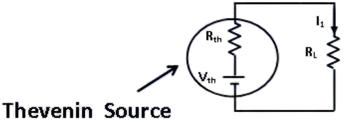
 
Figure 4: Thevenin's Equivalent Circuit 
 

### <b>Advantages of Thevenin's Theorem:</b>

1. It reduces a complex circuit to a simple circuit viz. a single source of e.m.f. Vth in series with a single resistance Rth. 

2. It greatly simplifies the portion of the circuit of the lesser importance and enables us to view the action of the output part directly.

3. The theorem is particularly useful to find current in a particular branch of a network as the resistance of that branch is varied while all other resistances and e.m.f source remain constant.

### <b>Disadvantages of Thevenin's Theorem:</b>

1. This Theorem is not applicable to non-linear and unilateral networks.

2. There should not be magnetic coupling between the load and circuit, to be replaced by Thevenin's theorem.

3. Controlled source should not be used the load side, It can be used at any other branch of the circuit.

