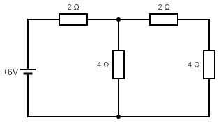
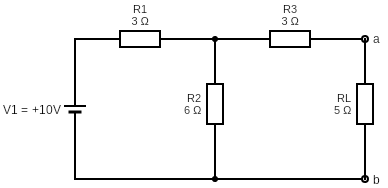
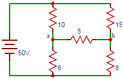
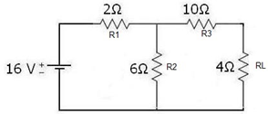
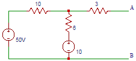

## Post Test

#### Please attempt the following questions

### 
<b>Superposition Theorem</b> 

Q1. Superposition theorem is not applicable for -

A   Voltage calculation
B   Bilateral elements
C   Power calculations
D   Passive elements

Q2. Which of the following are passive bilateral element -

A  Resistor
B  Capacitor
C  Inductor
D  All of the above

Q3. Which of the following is non linear device -

A  Inductor
B  Diode
C  Capacitors
D  None of the above

Q4. Find the voltage due to 15A source -
       

A   0V
B   2V
C   1V
D   3V

Q5. Find the current magnitude in 20Ω resistor in circuit in below circuit?
         

A   1.5A
B   0.0075A
C   0.92A
D   0.84A

### 
<b>Norton's Theorem</b> 

Q6. While applying Norton’s theorem in two port network, the network is replaced with-
         
A   An equivalent current source in parallel with an equivalent impedance
B   An equivalent current source in series with an equivalent impedance
C   An equivalent voltage source in parallel with an equivalent impedance
D   An equivalent voltage source in series with an equivalent impedance

Q7. If two identical 3A, 4Ω Norton equivalent circuits are connected in parallel with like polarity, the combined Norton equivalent circuit will be

A   3A,8Ω
B   6A,8Ω
C   0A,2Ω
D   6A,2Ω

Q8. Which of the following circuits is/are correct about Norton’s theorem.
i. The value of current source is the short circuit current between the two output terminals of the network.
ii. Resistance is the equivalent resistance measured between the load terminals of the network. Sources are replaced by their internal resistance.

A  Only i is correct.
B  Only ii is correct.
C  Both i and ii are correct.
D  Both are incorrect.

Q9.Find the Norton resistance for the given circuit if 4 ohm in the load resistance?

A  7/3 ohms
B  3 ohms
C  10/3 ohms
D  2/3 ohms

Q10. Calculate the short circuit current if the 5 ohm resistor is the load resistance.

A  6 amp
B  3/2 amp
C  2/3 amp
D  4/3 amp

### 
<b>Maximum Power Transfer Theorem</b> 

Q11. For maximum power transfer from source to 5-j2 Ω of load, the source impedance will be -
         
A   j2Ω
B   -j2Ω
C   5+j2Ω
D   5Ω

Q12. The maximum power drawn by the load RL in the given circuit will be -

A   5W
B   2W
C   20W
D   10W

Q13. The maximum power drawn from source depends on -

A  Value of source resistance
B  Value of load resistance
C  Both source and load resistance
D  Neither source nor load

Q14.If ZL=ZS*, then?

A  RL=1
B  RL=0
C  RL=-RS
D  RL=RS

Q15.  Find the maximum power delivered by the source in the following circuit?

A  96.6
B  97.6
C  98.6
D  99.6

### 
<b>Thevenin Theorem</b> 

Q16. Which of the following is also known as the dual of Thevenin’s theorem?

A   Norton’s theorem
B   Superposition theorem
C   Maximum power transfer theorem
D   Millman’s theorem

Q17. Find the current through 5Ω resistor in the following circuit?

A  0.1
B  0.2
C  0.3
D  0.4

Q18. Find Vth and Rth?

A  11.5 ohm, 12 V
B  6 ohm, 16 V
C  18 ohm, 16 V
D  8 ohm, 8 V

Q19. Calculate the Thevenin resistance across the terminal AB for the following circuit.

A  4.34ohm
B  3.67ohm
C  3.43ohm
D  2.32ohm

Q20. Determine the equivalent Thevenin’s voltage between terminals A and B in the circuit shown below.

A  5
B  15
C  25
D  35

