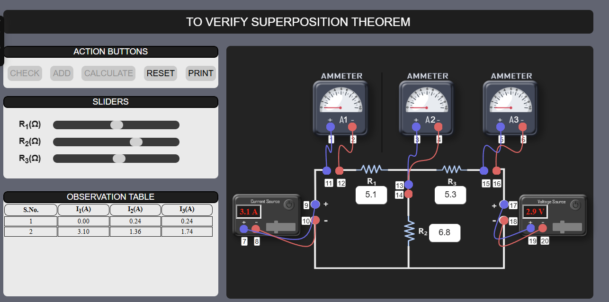

### Steps to perform experiment

###  
 1. Superposition Theorem  

 <b>STEP 1 :</b> Set the values of resistances R1, R2, R3 by adjusting the sliders.  
 <b>STEP 2 : </b> Make connections as per the instructions given below:   
 <b>CASE 1:(a) </b> When we consider Voltage source and open circuit Current source.  
 <b>(b)</b>Connect voltage source (17-19 and 18-20).  
 <b>(c)</b>Connect the Ammeters (1-11 and 2-12), (3-13 and 4-14), (5-15 and 6-16).  

  

 <b>(d)</b>Now, Check the connections by clicking on <b>‘CHECK’</b> button.  
 <b>(i)</b>If the connections are <b>‘Invalid’</b> click on corresponding label to remove the connection.   
 <b>(ii)</b>And if the connections are <b>‘Right Connections’</b> then follow the below steps.   
 <b>(e)</b>Turn ON the voltage source supply by clicking on the <b>‘POWER’</b> button and vary the voltage by moving the slider.   
 <b>(f) </b>Now, Click on <b>‘ADD’</b> button to add the readings in the observation table.  
 <b>(g)</b> Don’t Reset the experiment, Remove the connections (17-19 and 18-20) by clicking on the corresponding labels.   
 <b>Case 2:(a)</b> When we consider Current source and short circuit voltage source.  
 <b>(b)</b>Connect current source (7-9 and 8-10) and short (17- 18).   
 <b>(c)</b>Connect the Ammeters (1-11 and 2-12), (3-13 and 4-14), (5-15 and 6-16).  

   

 <b>(d)</b>Now, Check the connections by clicking on <b>‘CHECK’</b> button.   
 <b>(i)</b>If the connections are <b>‘Invalid’</b> click on corresponding label to remove the connection.   
 <b>(ii)</b>And if the connections are <b>‘Right Connections’</b> then follow the below steps.   
 <b>(e)</b>Now, Turn ON the current source supply by clicking on the <b>‘POWER’</b> button and vary the current by moving the slider.   
 <b>(f)</b> Now, Click on <b>‘ADD’</b> button to add the readings in the observation table.  
 <b>(g)</b> Don’t Reset the experiment, Remove the connections (17-18) by clicking on the corresponding labels.   
 <b>CASE 3:(a) </b> When we consider both Voltage and current source.  
 <b>(b)</b>	Connect current source (7-9 and 8-10) & voltage source (17-19 and 18-20).  
 <b>(c)</b>	Connect the Ammeters (1-11 and 2-12), (3-13 and 4-14 , (5-15 and 6-16).  

  

 <b>(d)</b>Now, Check the connections by clicking on <b>‘CHECK’</b> button.	  
 <b>(i) </b>If the connections are <b>‘Invalid’</b> click on corresponding label to remove the connection.  
 <b>(ii)</b>And if the connections are <b>‘Right Connections’</b> then follow the below steps.   
 <b>(e)</b>Now, Turn ON both the power source by clicking on the <b>‘POWER’</b> button.   
 <b>(f)</b> Now, Click on <b>‘ADD’</b> button to add the readings in the observation table.  
 <b>STEP 3:</b> Click on <b>‘CALCULATE’</b> button to calculate the total current.  
 <b>STEP 4:</b> In Calculation section, We have to manually calculate the total current by using the formula and verify it with the help of ‘VERIFY’ button.  
 <b>STEP 5:</b> Click on <b>‘PRINT’</b> button to takeout the print of the webpage.  
 <b>STEP 6:</b> Click on <b>‘RESET’</b> button to reload the webpage.  

 ### 
 2. NORTON'S THEOREM   

<b>STEP 1:</b> Set the values of resistances R1, R2, R3, RL by adjusting the sliders. 
<b>STEP 2:</b> Make connections as per the instructions given below:  
<b>Case 1:</b>(a) To measure RN short circuit the terminals for power supply (7-8) and connect multimeter with circuit (3-9 and 4-11).  

  

(b) Now, Check the connections by clicking on <b>‘CHECK’</b> button. 
(i) If the connections are <b>‘Invalid’</b> click on corresponding label to remove the connection. 
(ii) And if the connections are ‘Right Connections’ then follow the below steps. 
(c) Now click on <b>‘ADD’</b> button to add the readings in the observation table. 
(d) Don’t Reset the experiment, Remove the connections (7-8) and (3-9, 4-11) by clicking on the corresponding labels  
<b>Case 2:</b>(a) Measure Isc by connecting the power supply with the circuit (5-7 and 6-8) and connect the ammeter (1-9 and 2-11). 

  

(b) Now, Check the connections by clicking on <b>‘CHECK’</b> button. 
(i) If the connections are <b>‘Invalid’</b> click on corresponding label to remove the connection. 
(ii) And if the connections are ‘Right Connections’ then follow the below steps. 
(c) Now, Turn on the power supply by clicking on the <b> 'POWER'</b> button and vary the voltage by moving the slider. 
(d) Now, Click on <b>‘ADD’</b> button to add the readings in the observation table. 
(e) Don’t Reset the experiment, Remove the connections (2-11) by clicking on the corresponding labels.  
<b>Case 3:</b> (a)  Now, Measure the IL by connecting the power supply with the circuit (5-7 and 6-8) and connect ammeter (1-9 and 2-10 and 11-12). 

  

(b) Now, Check the connections by clicking on <b>‘CHECK’</b> button. 
Note : Note: Now, follow the <b> CASE 2</b> steps after checking the connections till (d) point. 
<b>STEP 3:</b> Now, Click on <b>‘CALCULATE’</b> button to calculate the load current(IL). 
<b>STEP 4:</b> In Calculation section, We have to manually calculate the Load current (IL) by using the formula and verify it with the help of <b> ‘VERIFY’</b> button. 
<b>STEP 5:</b> Click on <b>‘PRINT’</b> button to take out the print of the webpage. 
<b>STEP 6:</b> Click on <b>‘RESET’</b> button to reload the webpage. 

###  
 3. MAXIMUM POWER TRANSFER THEOREM 

<b>Step 1:</b> Choose a load resistance by adjusting RL slider. 
<b>Step 2:</b> Make connections as per the instructions given below: 
i. (7-9), (8-10)  
ii. (1-13), (2-14)  
iii. (3-11), (4-12) 
iv. (5-13), (6-14) 
<b>Note: Click on the label to delete the connection for the corresponding node.</b>  

  

<b>Step 3:</b> (a) Now, Check the connections by clicking on <b>‘CHECK’</b> button. 
(b)  If the connections are <b>‘Invalid’</b> click on corresponding label to remove the connection. 
(c) And if the connections are ‘Right Connections’ then follow the below steps. 
<b>Step 4:</b> Turn <b>ON</b> the MCB. 
<b>Step 5:</b> Turn <b>ON</b> the power supply by clicking on the <b>‘POWER’</b> button and Vary the Voltage by moving the slider. 
<b>Step 6:</b> Vary the resistance (R1) by moving the slider. 
<b>Step 7:</b> Now, Click on <b>‘ADD’</b> button to add the readings in the observation table. 
<b>Step 8:</b> Keep changing the values of resistance (R1) until the Power transferred is Maximum. 
Note: Take at least 6 readings in the observation table.  
<b>Step 9:</b> Click on <b>‘PLOT’</b> button to plot the graph. 
<b>Step 10:</b> Click on <b>‘PRINT’</b> button to take out the print of the webpage. 
<b>STEP 11:</b> Click on <b>‘RESET’</b> button to reload the webpage. 

### 
 4. THEVENIN'S THEOREM  

<b> STEP 1:</b> Set the values of resistances R1, R2, R3, RL by adjusting the sliders.   
<b> STEP 2:</b> Make connections as per the instructions given below:    
<b> Case 1: (a)</b> To measure RTH short circuit the terminals for power supply (9-10) and connect Multimeter with circuit (5-11 and 6-13).  
<b>(b)</b> Now, Check the connections by clicking on <b>‘CHECK’</b> button.  

  

<b>(i)</b> If the connections are <b>‘Invalid’</b> click on corresponding label to remove the connection.  
<b>(ii)</b> And, If the connections are <b>‘Right Connections’</b> then follow the below steps.  
<b>(c)</b> Now click on <b> ‘ADD’</b> button to add the readings in the observation table.  
<b>(d)</b> Don’t Reset the experiment, Remove the connections(9-10), (5-11 and 6-13) by clicking on the corresponding labels.   
<b> Case 2: (a)</b>  Now, Measure VTH by connecting the power supply with the circuit (7-9 and 8-10) and connect the voltmeter (1-11 and 2-13). 
<b>(b)</b> Now, Check the connections by clicking on <b>‘CHECK’</b> button. 

  

<b>(i)</b> If the connections are <b>‘Invalid’</b> click on corresponding label to remove the connection. 
<b>(ii)</b> And, If the connections are <b>‘Right Connections’</b> then follow the below steps.  
<b>(c)</b> Now, Turn on the power supply by clicking on the <b> ‘POWER’</b> button and vary the voltage by moving the slider. 
<b>(d)</b> Now, Click on <b> ‘ADD’</b> button to add the readings in the observation table. 
<b>(e)</b> Don’t Reset the experiment, Remove the connections(1-11 and 2-13) by clicking on the corresponding labels.  
<b> Case 3: (a)</b> Now, Measure the IL by connecting the power supply with the circuit (7-9 and 8-10) and connect ammeter (3-11 and 4-12 and 13-14). 
<b>(b)</b> Now, Check the connections by clicking on <b> ‘CHECK’</b> button.  

  

<b> Note: Now, follow the <b>CASE 2</b> steps after checking the connections till (d) point. </b>  
<b> STEP 3 :</b> Now, Click on <b>‘CALCULATE’</b> button to calculate the load current(IL). 
<b> STEP 4 :</b> In Calculation section, We have to manually calculate the Load current (IL) by using the formula and verify it with the help of <b> ‘VERIFY’</b> button. 
<b> STEP 5 :</b> Click on <b> ‘PRINT’</b> button to takeout the print of the webpage.  
<b> STEP 6 :</b> Click on <b> ‘RESET’</b> button to reload the webpage. 

  

 
